# Beginner's Guide to KiCad
###### _by: Pablo Villamejor_

This tutorial will walk you through a simple KiCad example project from schematic building to PCB layout. In this project we will be given a schematic plan to follow and construct from scratch. We'll also touch on library linking, editing, and creation. We'll also export our PCB's necessary fabrication outputs so the board can be manufactured.

Now to begin we must first download and install KiCad. Head over to [the download page of the KiCad website,](https://www.kicad.org/download/) select your operating system, and download the most recent model.

>[!IMPORTANT]
This tutorial was written using KiCad 8.0 on Windows 10. (i.e. Use this version to follow along.)

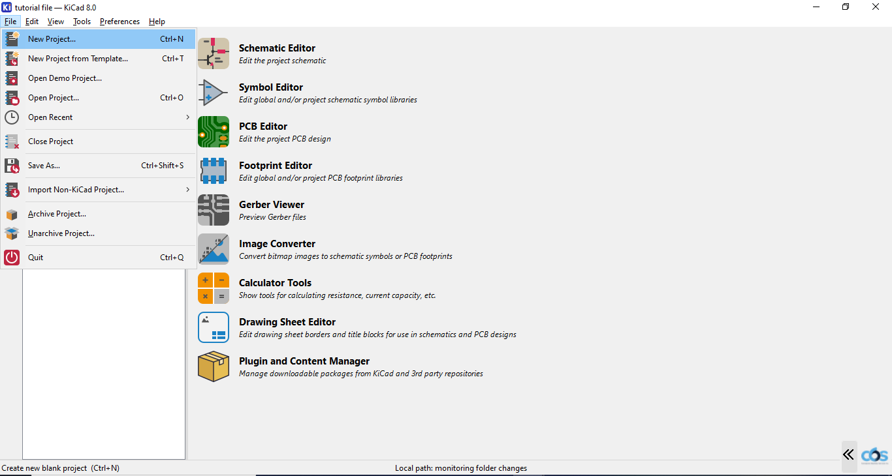
Once you install and open KiCad, you can go to _File, New Project,_ and then name it whatever you like. Once named, you may select __Schematic Editor__ to begin.

## Creating the Schematic
When opened, the __Schematic Editor__ should appear like this, plain and empty besides the red border and text boxes.  

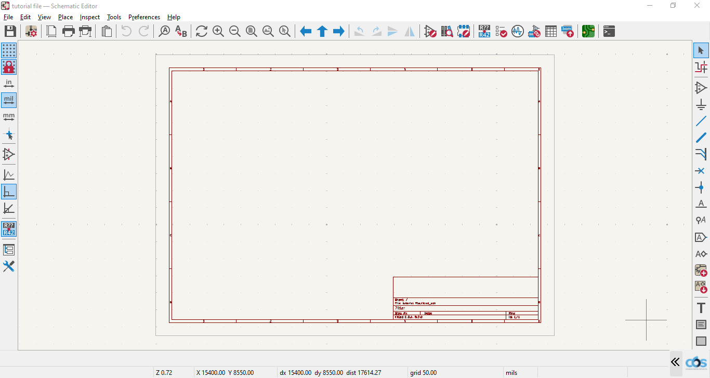

The objective of this project is to recreate this simple circuit and prepare it for manufacturing. The example has only 6 major components which will make this task more simple than most, but it is sufficient in order to understand the fundamental steps of KiCad and PCB design.

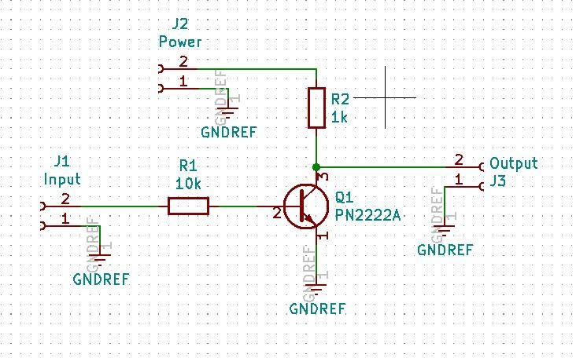

### Adding Symbols

To begin recreating this circuit, first add the components. This can be done using the _Add Symbols_ button on the right toolbar, or press the _"A"_ button on your keyboard, then left click anywhere on your workspace to begin selecting your component.

 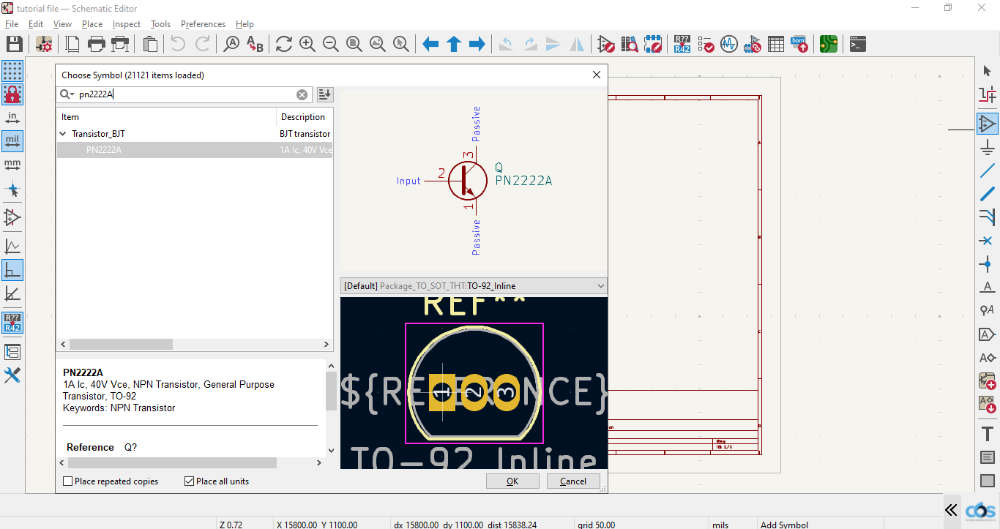

This will open up a window where you can input the name of the component you are trying to place. Most of the components have their names beside them (unless they were renamed, like is the case for the connectors in the example circuit) or use common electronic symbols which make them easy to recognize. When you have the part selected you can rotate it using the _"R"_ button on your keyboard then left click again on your workspace to place it. You can also use the _"X"_ and _"Y"_ keys to rotate it along the X or Y direction respectively. After you place a component, you'll notice you're still in placement mode. Hit the _"esc"_ button on your keyboard to return to normal pointer mode. This works for all placement modes in KiCad so if you are confused you can always click _"esc"_ to return to the normal mode

>[!TIP]
When placing any symbol, KiCad will automatically annotate it based on the order you placed them. These annotations are key to remaining organized when building and assembling the PCB. You can change the annotations by double clicking them and inputting it manually, this can be done at any time. There is no standard on how annotations should be done, it varies from designer to designer, but try to follow a simple system in your annotations to avoid confusion for you and future viewers of your work.

This example circuit uses one transistor, two resistors, and three 1x2 female connectors. Place all the components somewhat centrally to the workspace and similar to how they appear in the example. Once you have them all on the workspace you are ready to move on to the next step which is adding the reference grounds.

### Placing Power Symbols

The process is the same as adding in the components however, instead of selecting the _"Add Symbols"_ button, you select the _"Add Power Symbols"_ button underneath it, or use the _"P"_ button on your keyboard. 

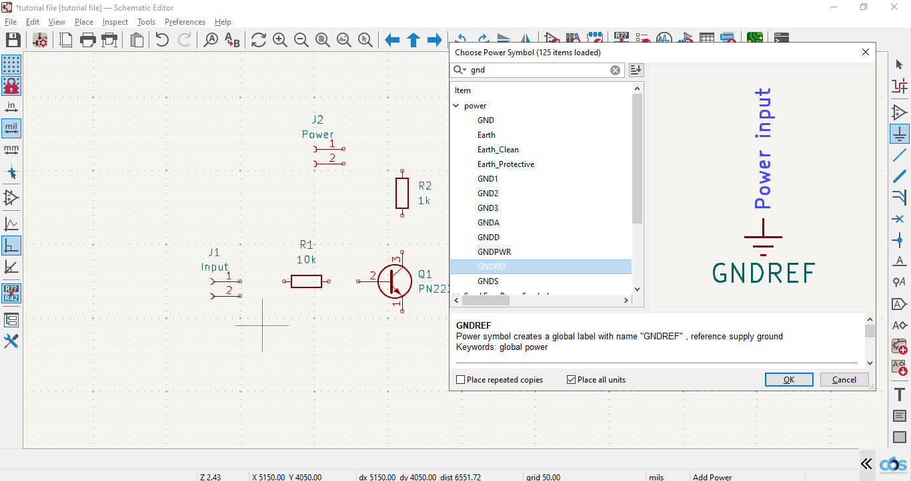

This will open up a similar window where you can search for the reference grounds. This window allows you to input all kinds of grounds, power sources, and various other power related symbols. When you've placed one down, you do not need to follow the same process for the rest of them. You may simply copy the component by clicking it and pressing _"ctrl + c"_ or hovering over it and pressing _"C"_ on your keyboard. Then pasting with _"ctrl + v"_

### Wiring the Schematic
Once you have all four ground references placed, you are ready to begin wiring the components. You can begin this by pressing the _"Add a Wire"_ button on your right toolbar, or press the _"W"_ button on your keyboard. Then simply left click on the component connectors, creating the necessary connections, and following the example circuit.

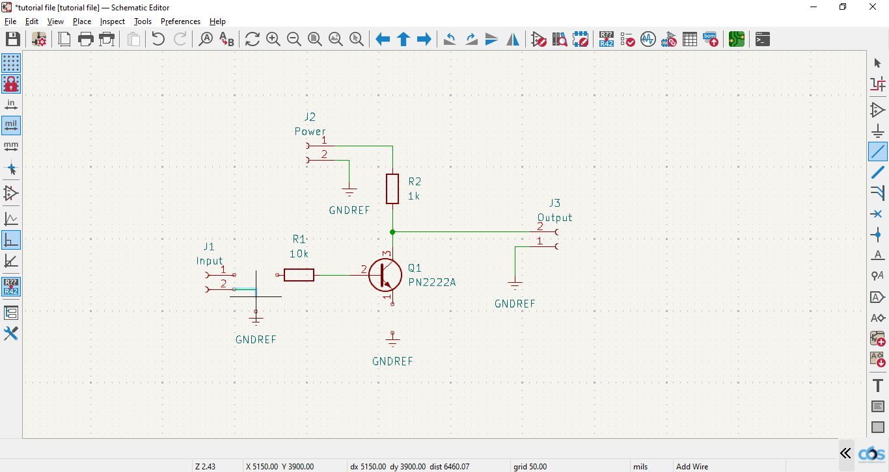

When you are done wiring, the circuit is functionally the same as the example. Now we just need to rename the various input terminals. This wont affect the functionality of the circuit, it is just a good industry practice to name your components for and future viewers of your schematics. As you can see from the image above I have already renamed my connectors, to do this you need to simply double click on the name of the component, or press the _"V"_ button on your keyboard while hovering over the component. This will open a window where you can input whatever name you'd like to give to the component.

### Running an Electrical Rules Check
Congratulations! If you finished up to here then you have successfully recreated the circuit in your _Schematic Editor_. The next step is to run an _Electrical Rules CHECK_ or _ERC_. This can be found on the upper toolbar on the right hand side. This just checks if the circuit you created follows all the basic electrical rules. It is basically a way to check if you forgotten anything important.

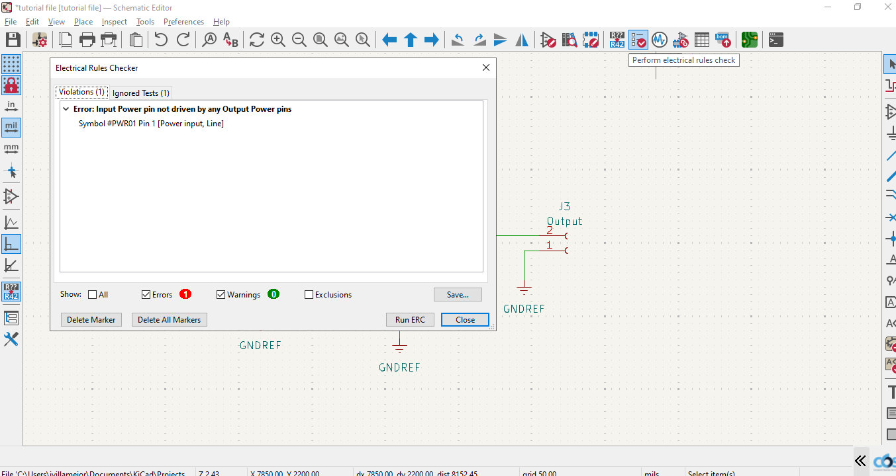

When ran the ERC reveals one error, as shown in the image above. This is a simple error basically saying that KiCad is can not distinguish which connector is the power input. You, the designer, knows which is the power input as you labelled the connector "POWER" but KiCad does not. This can be fixed by simply placing a Power Flag on the wire connecting the power input connector and its ground reference. The power flag can be found in the _"Add Power Symbols"_ window as the first result when you type "flag". You will know if you done it right if whe  your run the ERC again it will show no errors. 

### Assigning Footprints

We are almost done with the schematic editor, now we must assign the 3-Dimensional footprints to the symbols of the components. This will allow us to move on to the PCB editing. Footprints basically tell KiCad the exact dimensions of the real world component so that you may precisely pick where on your PCB board each component goes. 
To begin selecting the footprints, press the _"Run Footprint Assignment Tool"_ on the top toolbar. This will open up a window showing all the footprint libraries that KiCad has automatically installed on the left, the components in your schematic in the middle, and the applicable footprints for the chosen schematic on the right. 

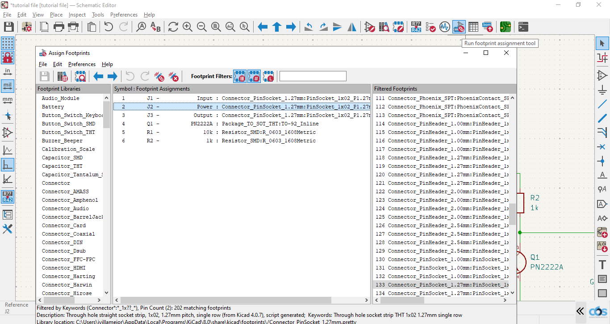

As you can see in the image above, I already assigned the footprints to the symbols. Some of the components had footprints automatically selected; you do not have to edit those unless you have a specific version in mind. Footprints are usually provided by the real world component supplier. That is why there are so many different footprints for each schematic as different manufacturers provide slightly different products. When picking a footprint, you must make sure that the version you are picking is readily available for purchase and can meet your supply needs. Senior designers will know which electronics brands and manufacturers create the best components when choosing footprints. There are many different factors when selecting footprints, and is something that requires experience to develop. For now you may simply select the footprints I selected by searching their names in the search bar. 

>[!TIP]
 You can right-click any footprint and select "view selected footprint" to see how the footprint looks. You can then click the "Show 3D Viewer" on the top toolbar, or press "Alt + 3" to view the 3D rendered view of the component.

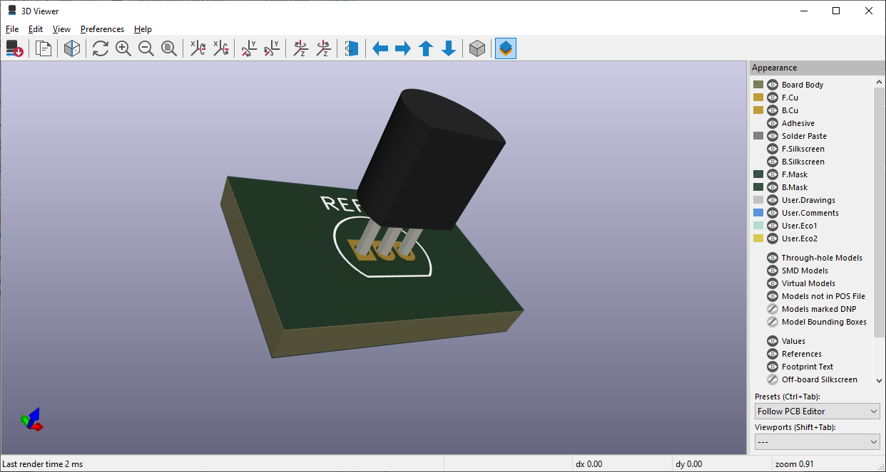

## PCB Editor

With the schematic completed and the footprints assigned, we can move on to designing the PCB itself. You can move on from the schematic editor to the PCB editor by pressing the _"Open PCB in Board Editor"_ on the top toolbar on the right side. Or you can simply return to the main KiCad window and select _"PCB Editor"_. __Don't forget to save the schematic editor file first!__

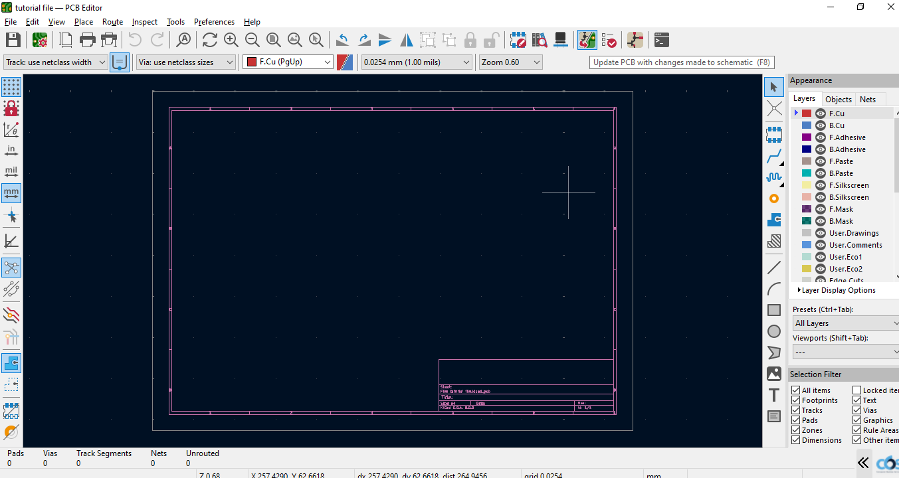

When you open up the board editor you will be greeted by this screen. To import the components from the schematic we just created, you need to press the _"Update PCB with changes made to the schematic"_ button on the top toolbar on the right side, or by simply pressing _"F8"_ on your keyboard. This button will automatically import the components allowing you to place them all at once. This button also automatically creates a netlist as this step used to have to be done manually in earlier KiCad versions.

 >[!NOTE]
 The netlist contains information regarding components, their designators, pins, and the names of any nets that connect each pin to components. Manufacturers may require this file for assembly. How to export this file, along with other files needed for PCB manufacturing, will be discussed near the end of the tutorial.

### PCB Setup

The _"Update PCB with changes made to the schematic"_ button can be pressed at any point in the editing process so don't be afraid to go back and change the schematic if you uncover issues. Because of that, before you place the components its always a good idea to set up your PCB by pressing the _"Edit Board setup"_ button on the top toolbar on the left.

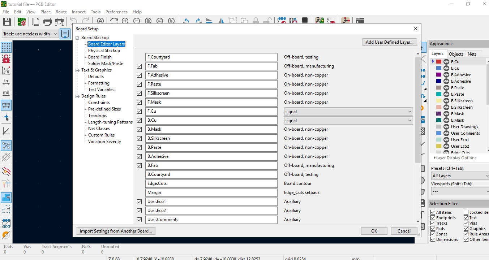

In the PCB setup editor, you can change the different layers in the PCB. You can select which layers you need for specific projects. You can edit many different aspects and tools for the editor, most are technical while some are purely aesthetic.

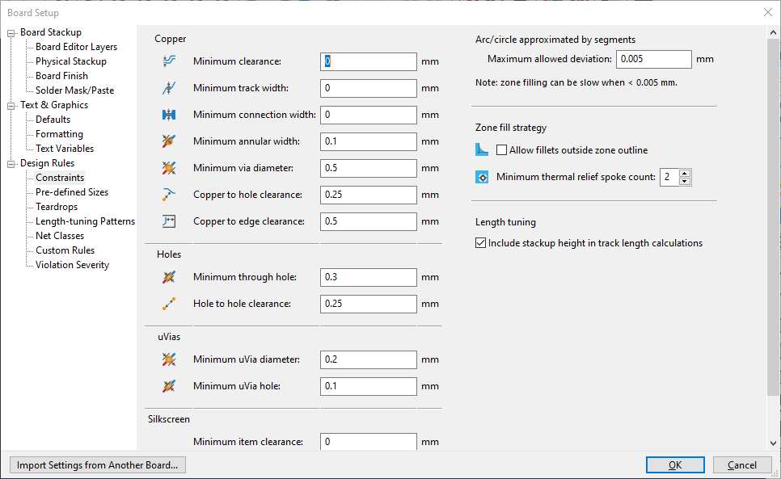

One of the more important things to edit is the design rules, more specifically the constraints. These are usually set by manufacturers and can make or break the PCB design. Its always good to copy the values for each of these parameters based on your chosen PCB manufacturer's recommendations __before__ starting PCB editing. Since this project is simply an example you can leave those as is.

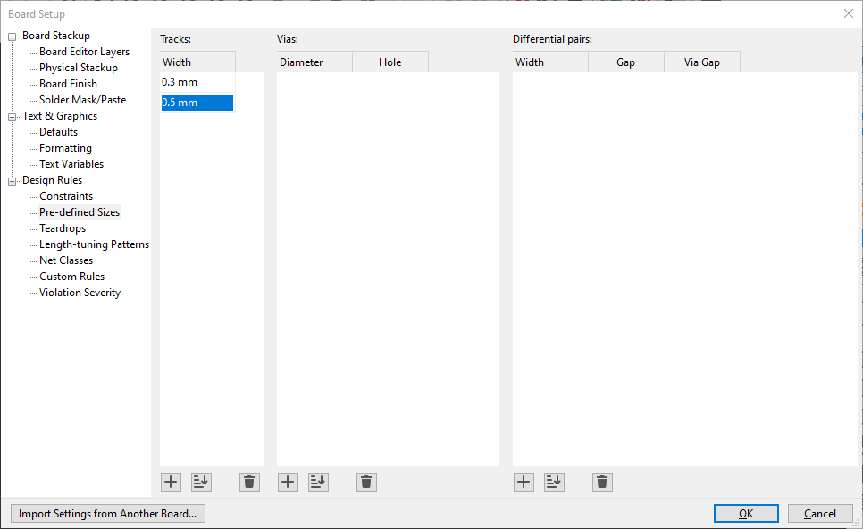

Leave most of the PCB setup as is as they are not necessary changes for this project. The only thing you must add is some _Pre-defined track sizes_. Go to the _"Pre-defined Sizes"_ tab and place a 0.3mm and a 0.5mm track size using the plus sign on the button. Tracks are the equivalent of wires in PCB editing so this gives us two set sizes to work with. 0.3mm for basic components and 0.5mm for any power related component. These sizes are not standards and should not be followed in every project, they are simply common and versatile track sizes that may come in handy during later steps. Once that is completed you may click ok.  
 __*When all your setup is complete you may now press F8, then press "Update PCB", and place your components somewhat centrally*__

### Arranging Footprints
When you place them down you'll see they all are imported in a pile which can be a little messy. Now you can see why annotations are important for organization. You can move the components by clicking and dragging them to place where you'd like. You can also hover over the component and press _"M"_ on your keyboard.  

>[!TIP]
You can hide the F.Fab and B.Fab layers by looking for them on the layer list on the right and clicking the eye symbol. These fabrication layers don't add too much information and hiding them makes the board less cluttered.

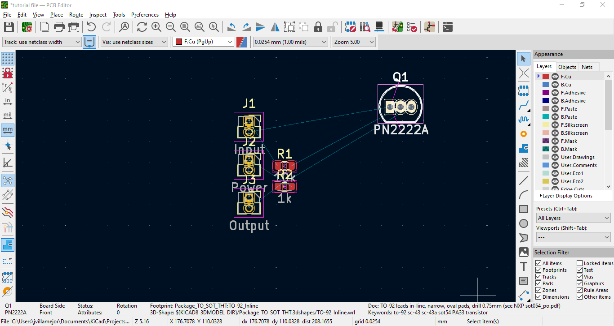

>[!TIP]
If you have two monitors, or you are adept at switching through tabs, you can select the part you wish to edit on your Schematic editor by clicking it and it will be selected as well in the PCB editor. This helps a ton in more complex projects.

When moving them you will see a sort of web or net connecting the components. This is to show you exactly where each component is supposed to be connected to. This will show were you are supposed to route the tracks _(connect the wires)_. Try and place the components in a way that makes the webs line up to where they are supposed to be connected. Try and make it so tracks are relatively direct and do not cross with each other, while the components are not too far spread. There are many, many, rules when it comes to component placing on a PCB; too many rules to go over in this tutorial. Many of these you will learn over time so for now just place them in a way that seems logical to you as this is just practice. 

>[!TIP]
Its good practice to start with the most crucial components then work your way down.

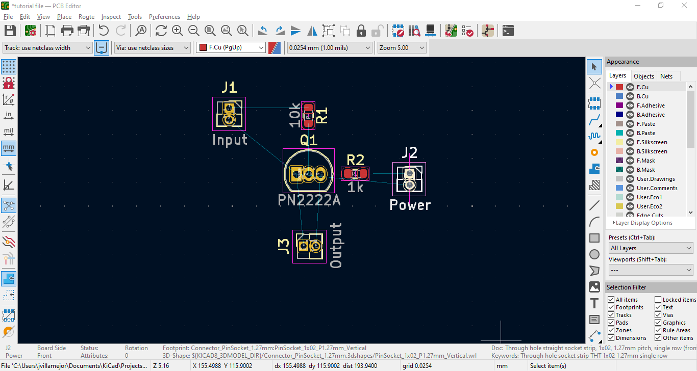

As you can see I placed the components so that the tracks do not run through anything too important. The only web that runs through a component is the reference ground of __J2__ but that is ok since we will not route the grounds in this project.  

    Tip : You can press "Alt + 3" at any point in this editor to view the 3D model of your design. As you can see in the image below the components mimic the placement on the editor.

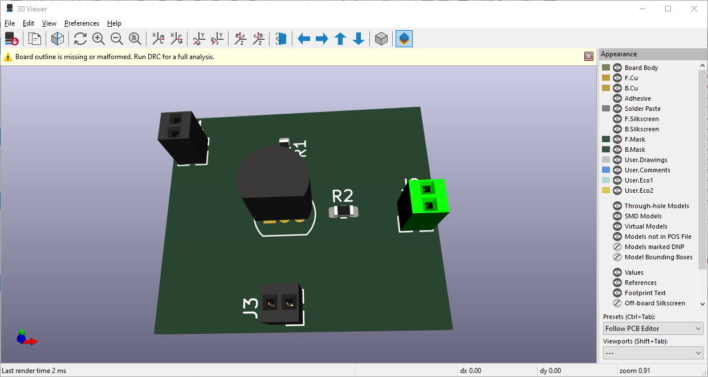

### Adding Board Outline
As you can see in the 3D editor and error appears that says _"Board outline is missing"_. That is simply because we have not set the board cut out size yet. To add that, first select the _"Edge.Cuts"_ layer in your layer list on the right. You will know its selected if a blue arrow appears next to the layer. 

We will be drawing lines in this layer to designate the board cut offs. This will set the board size for manufacturing. It is good practice to go for whole number sizes. For this project I am going for a 25mmx20mm board. To bring out the measuring tool you can press _"Ctrl + Shift + M"_

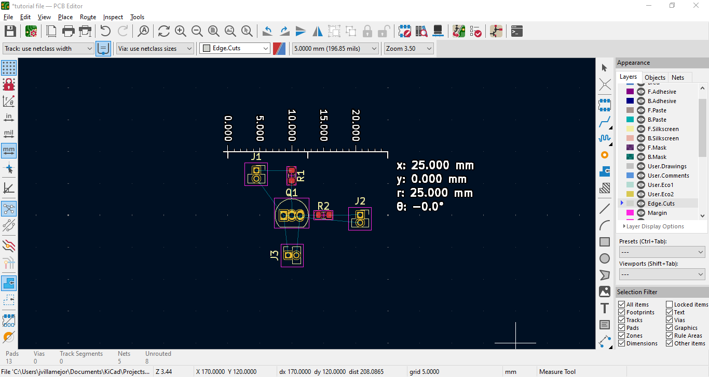

>[!TIP]
You can press the "N" button on your keyboard to change the grid size for greater accuracy. I recommend a grid size of 1mm for edge cutting.

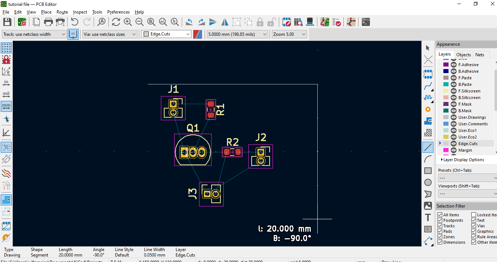

To draw the line, select the _"Draw a Line"_ tool on the right tool bar. Then draw the lines as an outline to the PCB. Feel free to move around the components so that they fit better, nothing is set in stone at this point. If you want curved edges you can use the arc tool under the line tool to create arcs on the edges. 

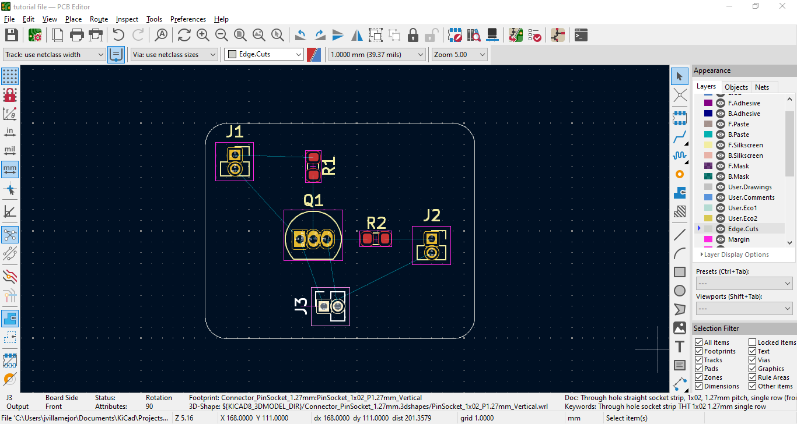

When finished, it should look something like this. The curved edges are optional so if yours are straight then that is fine. 

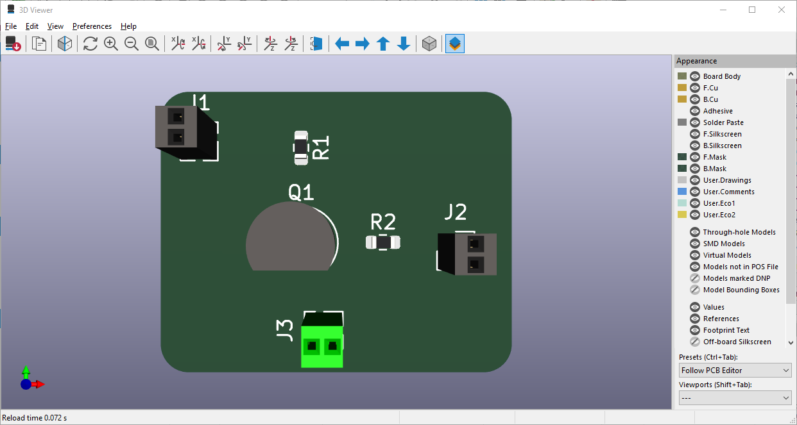

As you can see in the 3D viewer, The board cuts worked and KiCad now knows the shape our board will be.

### Routing the Components

Nice we have a rough layout formed, we can begin routing. This is usually the most tedious step that requires the most precision. However since our circuit is very simple, this process will not be too difficult. 

To begin, I like adding a copper ground plane. This makes it so we do not have to route any reference grounds, and it makes routing regular grounds easier as well.   
To do this, we need to first select the bottom copper layer (_"B.Cu"_ on your layer list), then click the _"Add filled Zone"_ button on your right toolbar. 

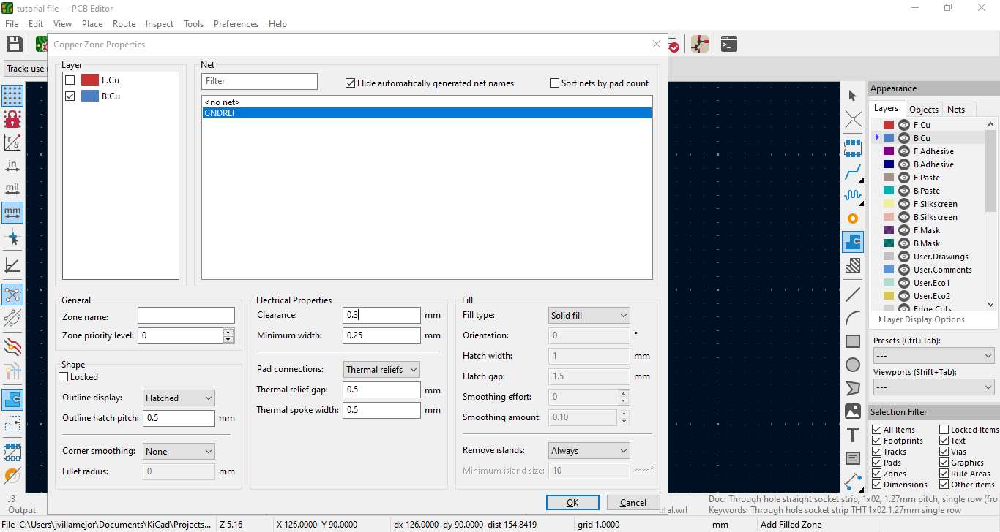

After pressing, this window will pop up. Select the GNDREF as that is what we want this plane to link. The clearances and widths for filled zones differ for different applications, but for this application you may simply change the clearance to 0.3mm. 

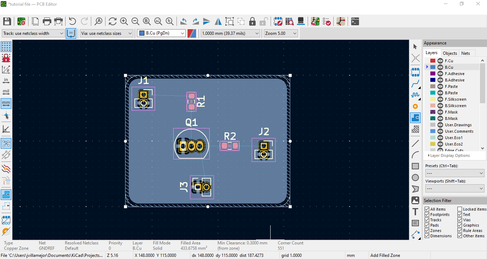

Once you set the various properties of the filled zone, you will be moved to drawing mode. Encompass your entire PCB in this drawing as shown in the picture above. Once the box is closed, you can press the _"B"_ key on your keyboard to fill the zone. This creates the bottom copper layer and is visible in the 3D viewer. 

>[!TIP]
You can hide the blue box by pressing the "Show only zone boundaries" on the left toolbar near the bottom. This makes routing so much easier on the eyes.

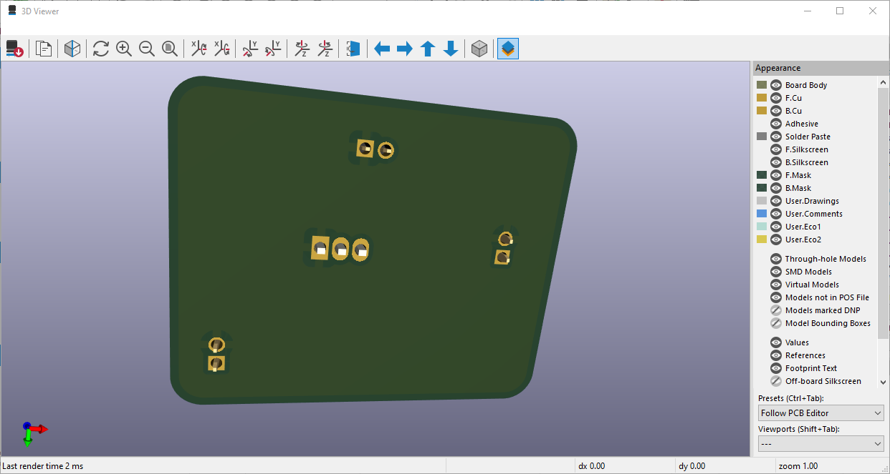

The square holes usually indicate grounds in the industry so you can see that all our reference grounds no longer need to be routed. This makes future routing of non-reference grounds much easier since you can just punch a hole in the board (Press _"V"_ while the routing a ground). However since this design only uses reference grounds, we are finished routing the ground.

Next we will be routing the regular components. Its always a good rule of thumb to start at the most critical components. To start, simply press the _"Route Tracks"_ button on the right toolbar or the _"X"_ button on your keyboard. Click the portion of the component that the route needs to attach to, then trace the track towards the component it should connect to. You can always delete the tracks by selecting them and clicking _backspace_ or _delete_ or undo with   
_ctrl + z_  
 _Don't forget, 0.3mm for non-power related components!_

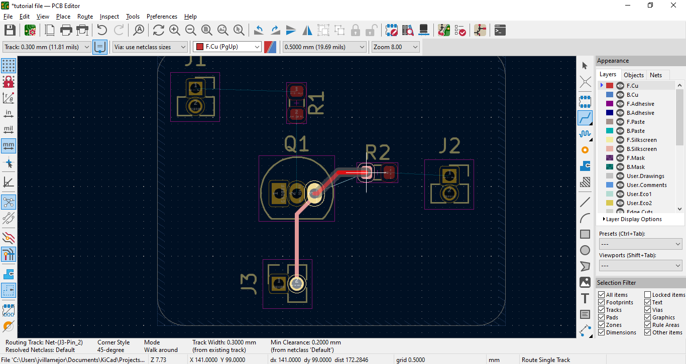

Its good practice to instantly move away from the component as you place the tracks. This makes more space for other tracks as the more space between tracks the less likely you'll experience an error later on. Just follow the net as to where to connect the tracks.   
_Don't forget, 0.5mm for power related components!_

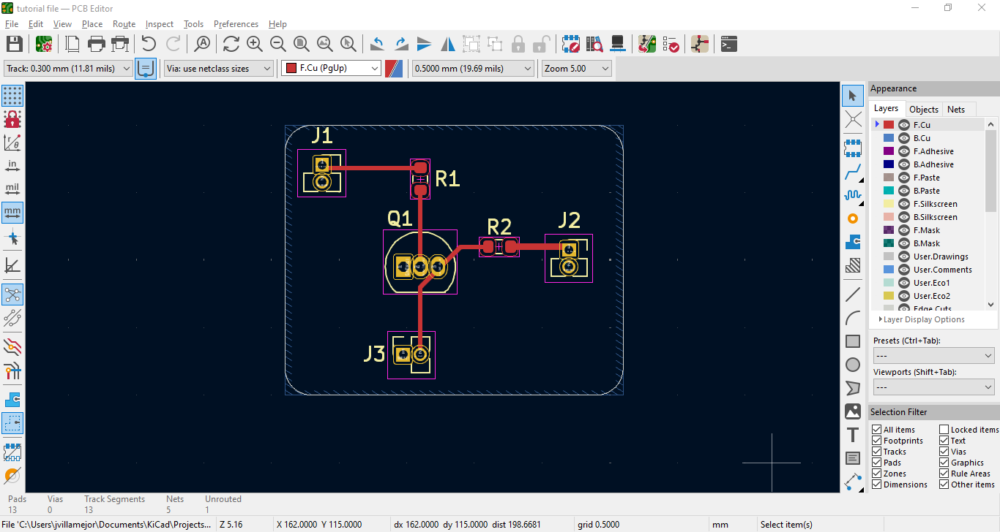

When you finished your routing your board will look similar to this. Since the circuit is so simple, none of the tracks are near each other so we didn't have to use any advanced techniques. Heres a simple tip, When routing a component you can click _"V"_. This drops the track one layer so that you can go underneath existing tracks. This is very important for mor complex designs. You can also see the tracks in the 3D viewer.

>[!TIP]
Move the silkscreen labels (J1, J2, Q1, ..etc.) out of the way of the tracks. These will be printed on the board and may be illegible if placed over a track.

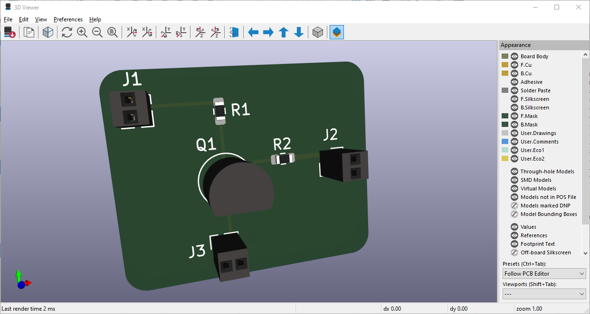

### Running a Design Rules Check

Now that the routing is finished, you can run a _"Design Rules Check"_. This is similar to the electrical rules check of the schematic editor. It makes sure you didn't forget anything too obvious and checks your design against the constraints you set in the setup. 
 
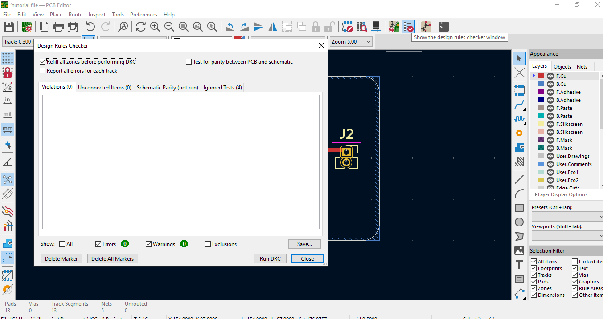

You can find it on the top toolbar near the right side. Since we did not set any constraints at the start, and our circuit is simple, the check should come out like this with no errors. 

## Exporting Gerbers and Other Key Files

Once your DRC has come back with no errors or unconnected items, your PCB is basically ready for assembly! We now need to export the files to send to the PCB manufacturers. These files are usually the Gerber files, the drill files, the BOM, and the netlist. Some manufacturers require more and some require less but knowing how to export these files is important going forward. 

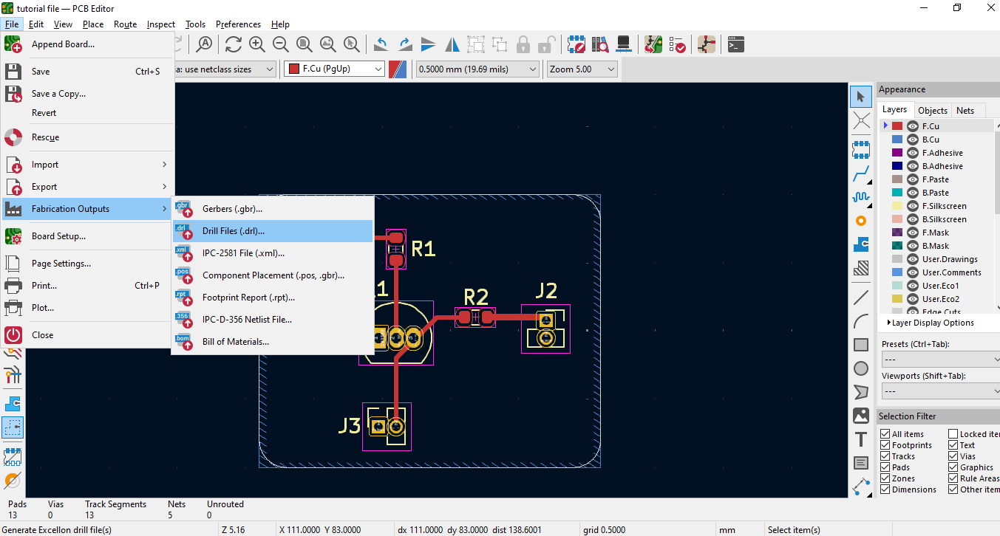

Simply go to _File_ then _Fabrication Outputs_ and select the files you need. Drill and Gerber files are the most critical files so start with those. I always do the drill files before the Gerber files

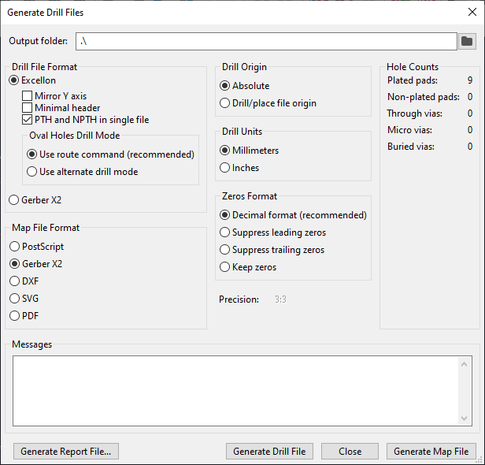

After selecting _"Drill Files"_ in _Fabrication Outputs_ you will be shown this screen. In this you can go into the specific of how you want this file created but we will not go into the details in this tutorial. You may research each of these options on your own but, for simplicity sake you may just use the defaults when Generating the files. Select the folder you want the files to be generated in and click the _"Generate Drill File"_ button

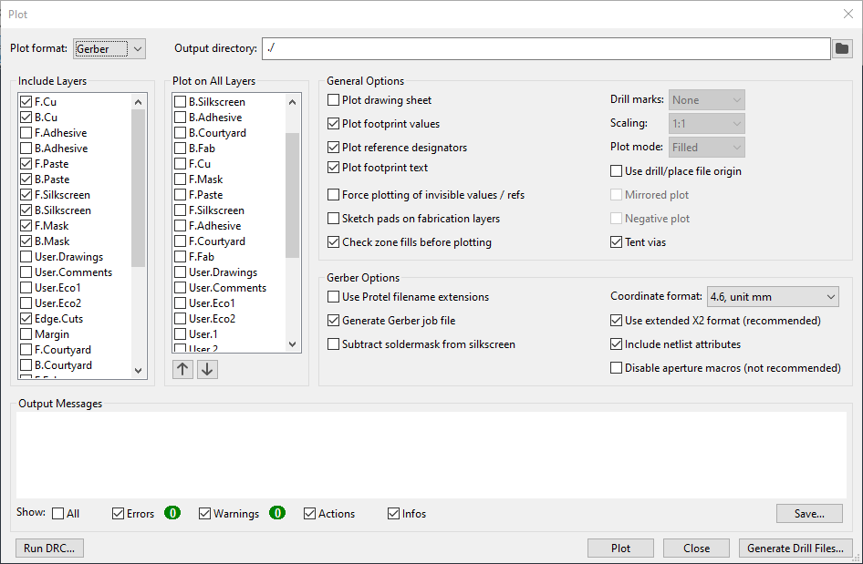

Once the drill files are generated, you can go and generate Gerber files. Same process as the Drill files, just select the _"Gerber Files"_ in _Fabrication Outputs_. In this window you will be able to pick which layers you want generated in the file as well as various other options. Again we will not go into the specifics, you can find resources on it all over the internet. For this practice simply input the target folder of these files and click _"Plot"_.

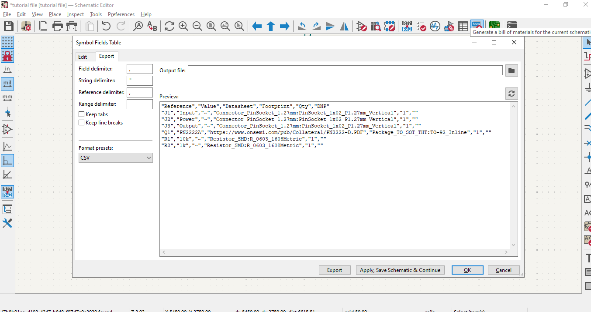

The bill of materials is a little different. You can just go to _Fabrication Outputs_ and download your BOM from their but we have not edited it yet. To do so you must go back to the _Schematic Editor_ and click the BOM button ont he top toolbar on the right side. This will open up the BOM editor where you can manually add the specific components you need for your device. When you finish editing it, you may press _Export_ to download the BOM file to the chosen folder.

## Viewing your Gerber files

KiCad has a built in Gerber viewer called __*Gerber Viewer*__ 

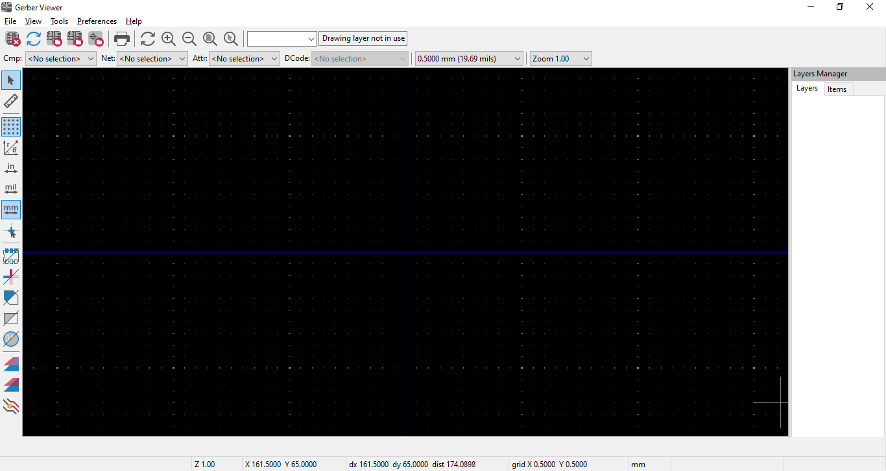

When opening it you will be greeted with this blank workspace. In order to open the Gerber files you just created you can go to _File_ then _Open Gerber Plot Files_ then go to the folder you selected they would be generated in and select all the files that end in _.gbr_

>[!TIP]
You can select multiple files by clicking the top Gerber file in the list then holding shift and clicking the bottom Gerber file.

When you load it up it should look like this. This shows what the manufacturer would receive to make your PCB. This is when you should do all your final checks to see any mistakes.

After loading up the Gerber files now you can go to _File_ then _"Open Excelon Drill Files"_ and select the drill file you just generated. You should see another layer get added as seen in the picture above. You can then start hiding layers to see every part of what you designed. 

Just click the check boxes on the right side layer list to hide the layers. This way you can double check every inch of your design. Once your satisfied with your design, you can send these files to a PCB manufacturer and have them made. Congratulations! With that you know all the basics of KiCad and PCB manufacturing.  

>[!IMPORTANT]
The guide isn't done just yet! Keep scrolling for some extra tips!

# Miscellaneous Tips
## Adding Symbol and Footprint Libraries
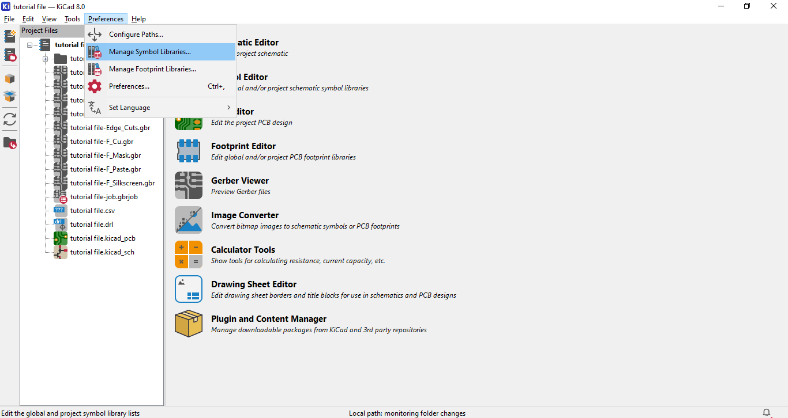

To edit your symbol or footprint libraries, you can got to _Preferences_ then select which you want to edit. The process is the same for both and are interchangeable. For this example, let us try adding a footprint library, but the steps are the same for symbols. 

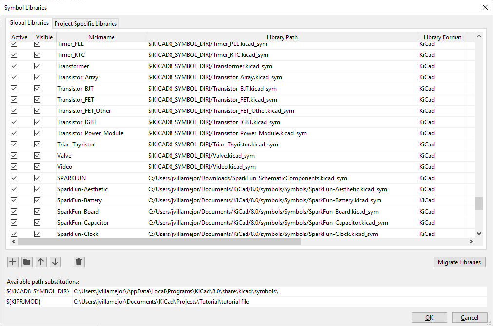

To begin you need a library to upload to KiCad. You can find various kinds online, I'll leave it up to you as to what you want to add to your KiCad. In this example I will be adding the _Sparkfun-Capacitors_ Library. As you can see I already have other Sparkfun libraries installed.

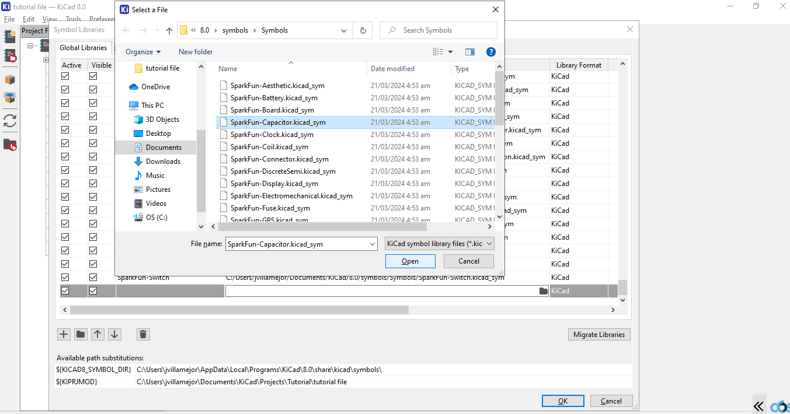

Once you have the files you can click the plus button, then the folder symbol in the empty row that was created, then navigate to the file you want to add. You can then assign a name to it and click ok. If the format of the files was right, you should be able to use your new symbols in the schematic editor. 

Don't forget to do the same for the footprint library or you wont be able to find the right footprints for your symbols!

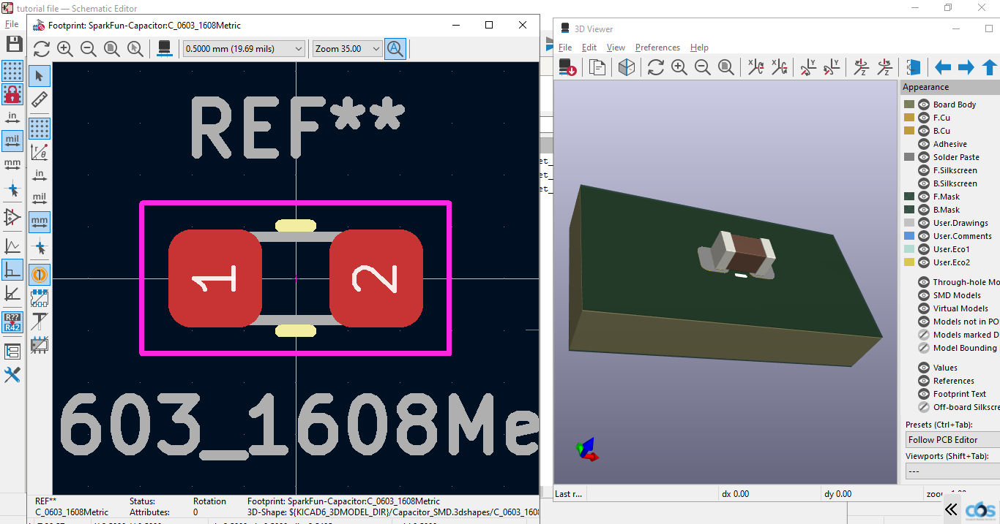

## Adding 3D models

Some footprints in the library are incomplete and do not have a 3D model. This is ok most of the time since it is not a requirement for assembly. You can design the entire PCB without using the 3D viewer; however, I think it helps you make informed decisions on components sizes and really helps the design process. If you want to add a 3D model to an incomplete footprint heres how!

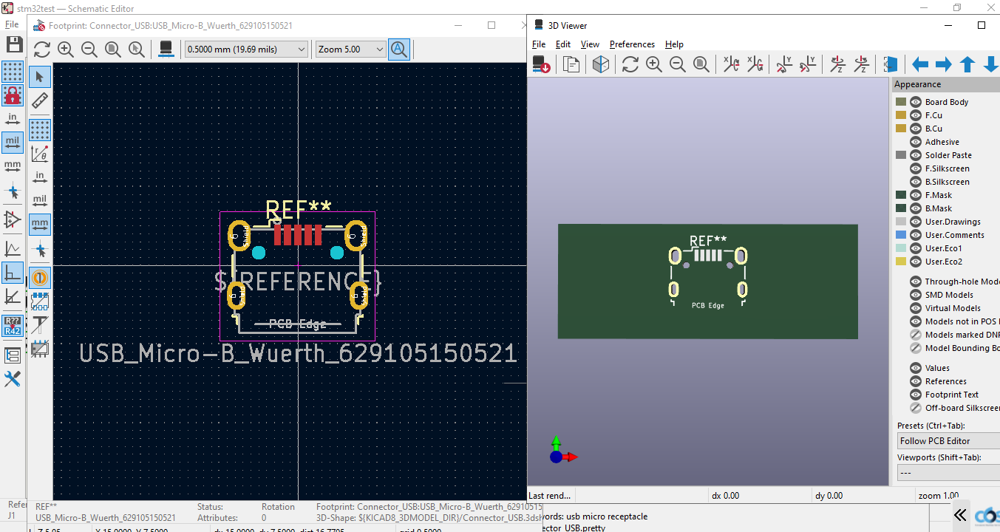
 
As you can see in the example, the footprint works and is correct but the 3D view is missing minus the pinholes. To add a working 3D model for this, we need to find it online. Usually manufacturers will provide these models and are usually relatively easy to find.

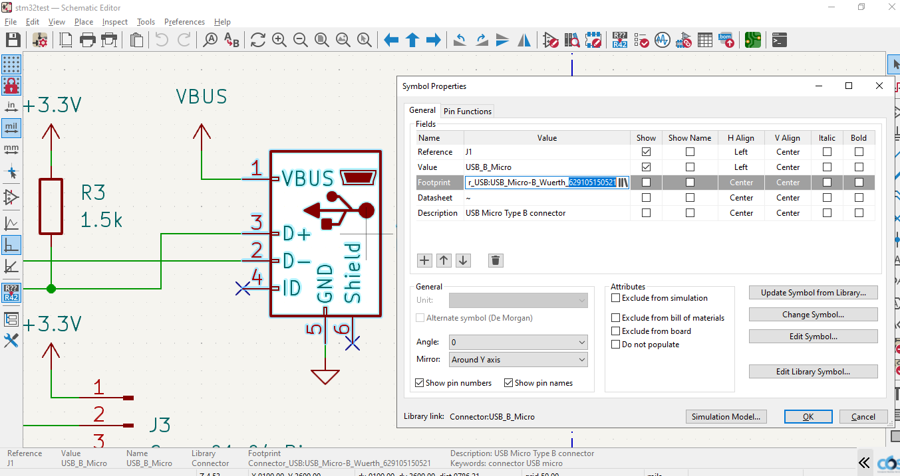

To do this you need to first select the part in the _Schematic Editor_ then double click it and look for the part number. In the image above, the part number is the numbers highlighted. Usually they are listed at the end of the footprint file name. When this number is googled, it leads to the manufacturers website. The site has a downloads section with the exact CAD we need. Download the STP file.

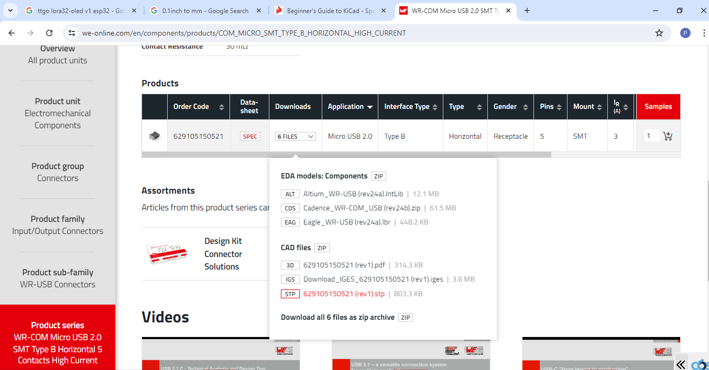

Once you have the file place it somewhere you can easily find it, I moved mine to the project file.

.png>)

Once you have the file and you know where it is, you now need to double click on the footprint in the __PCB Editor__ and this window should show up. Select the _3D Models_ section and you should see the broken model.

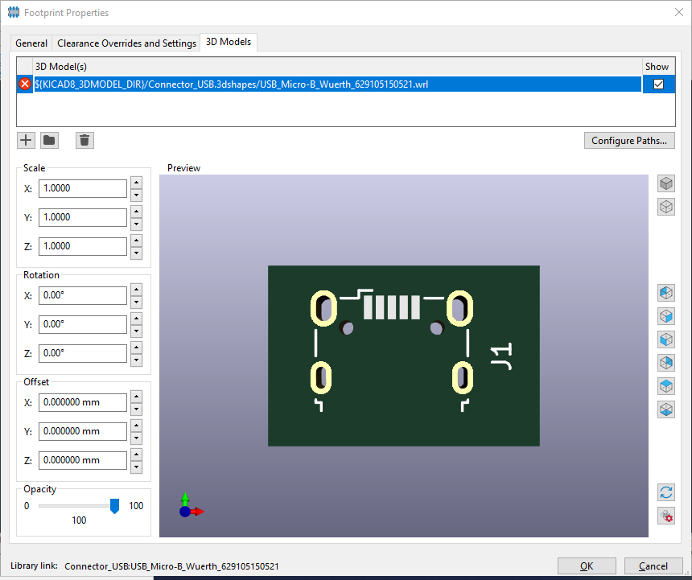

You can delete the broken model with the trashcan icon under the list of models. You can then use the folder icon to select the file you just downloaded. It should appear something like this.

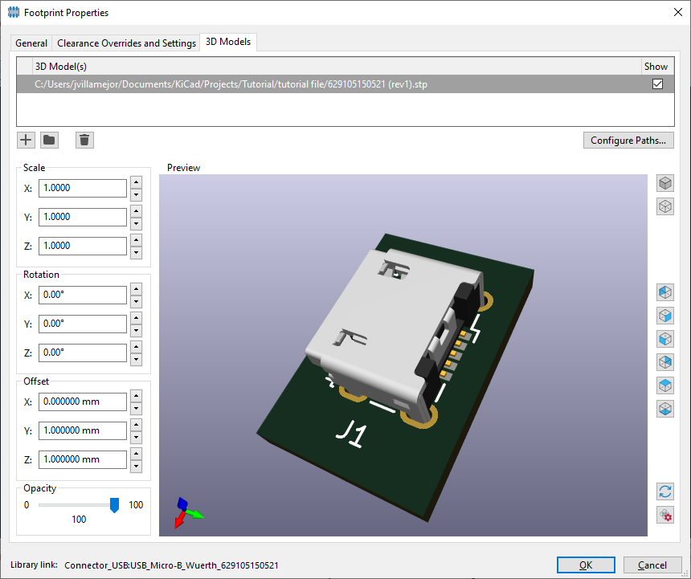

The model may need some scaling and offsetting to make it fit right. This particular model needed to be offset by 1mm in the Y and Z directions. This part may take some trial and error but when you get it right it will look perfect.

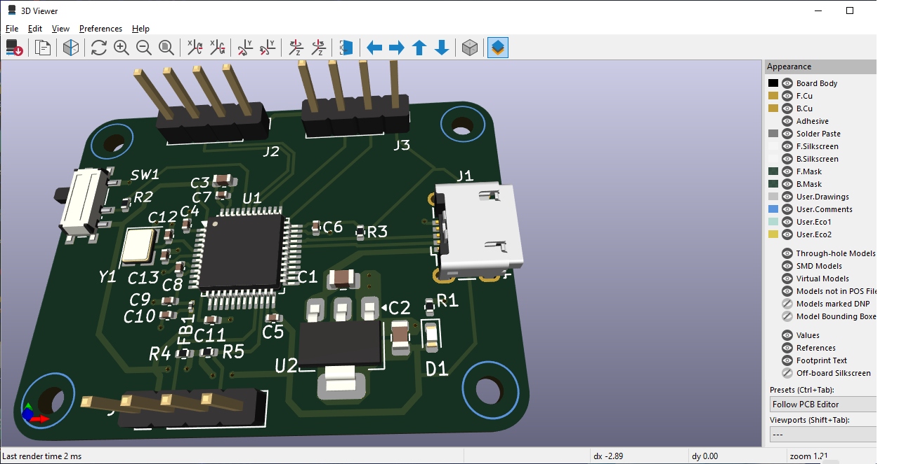

After clicking _Ok_ your footprint will have a working 3D model and will look right at place in your design!

## Creating Custom Footprints

In some cases you will need to use a part that does not have a library available online. In order to fix this we can create our own custom footprints and symbols. 

To start making a custom footprint, go over to the main KiCad launcher and press _"Footprint Editor"_. Once there you will be greeted with a blank document. First start by creating a custom library to put your footprint in. You can do this by going to _File_ then _New library_. Name it whatever you like and select _Global_ so that the footprint is available for all your future projects. Then you select the type of component you are making, in this example we will create a through hole type component.

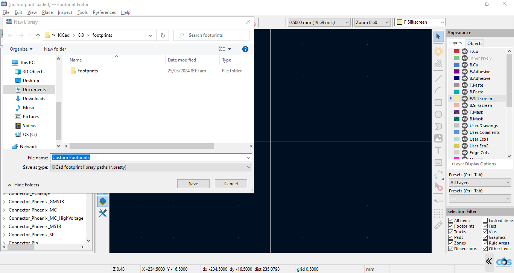

In order to create a footprint, you need the precise measurements of the pad distances and the sizes. The image shown below is incomplete and missing some crucial data but you can always find what you need with a pair of calipers. In creating the footprint we need to be as precise as possible. 

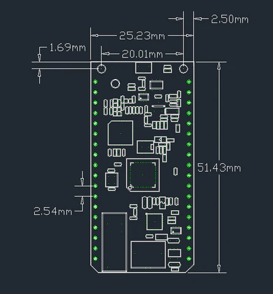

To begin, first find the distance between pads of the component you are trying to create. In my case, the space is 2.54mm. In order to precisely place these pads, we need to make use of the grid. Lucky for me there is a default 2.54mm grid which made my pad placing a lot easier. If the space between your pads is not found on the grid list, you may create a custom grid by clicking the drop down arrow of the grid selector then pressing _Edit Grids_. This will open up a window where you can press the plus sign to create you own custom grid.

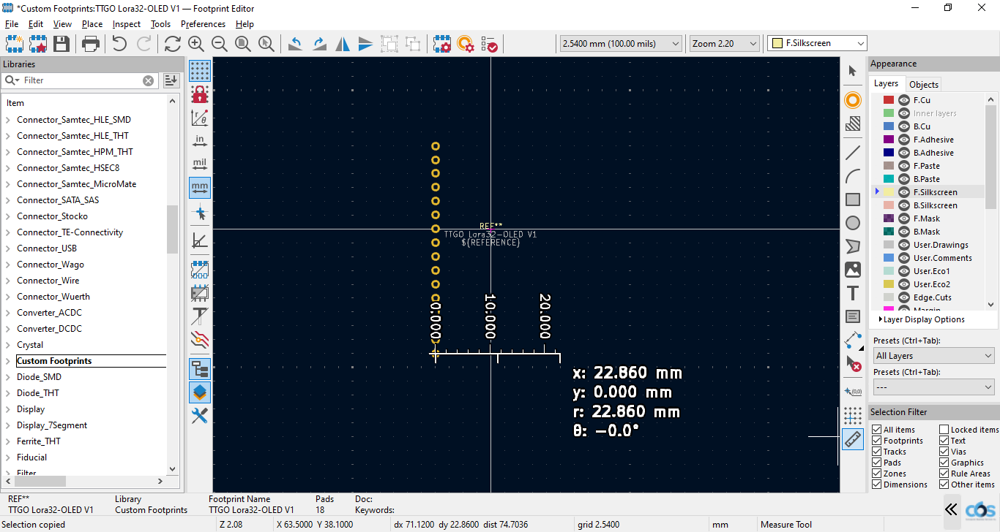

Now we move on to pad placement. To start select the _"Add a pad"_ button on the right toolbar on the top side. Then place the pads following your grid so that they are properly spaced. Make sure your in the Front silkscreen layer!. Once you placed one row of pads you can copy and paste them all to the other side. Make sure the measurements remain precise!

>[!TIP]
Don't forget you can use the measurement tool!

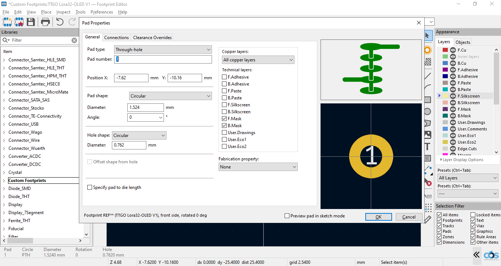

But wait! Before you copy and paste the entire row of pads, you can select them by double clicking the symbol. This way you can edit the pad number/name __(very important)__ as well as pad sizes, clearances, and many other variables. Make sure these settings match that of you component. Make sure the pins are properly spaced and size is accurate before copying it to the other side. 

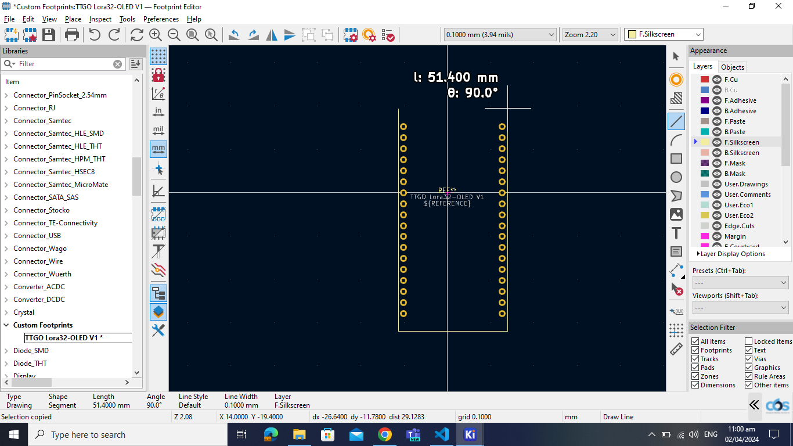

Next we will create the silkscreen outline. This makes it so an outline will be traced in the PCB for easier assembly. Its good to make this one slightly larger than the actual dimensions so that it is still slightly visible after mounting the component. 

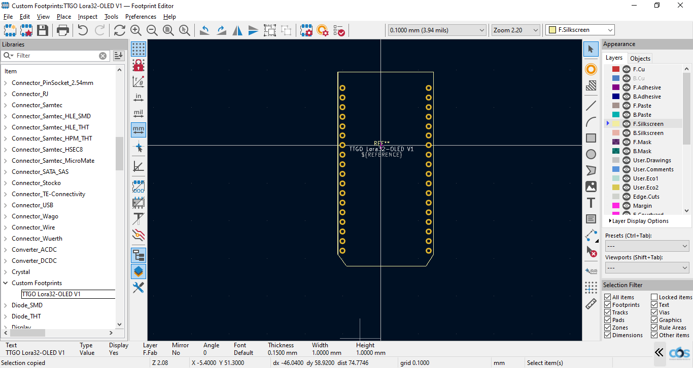

Since this step is not the most necessary, some footprints don't even have it, you do not have to be so accurate with this one. Try to make it look right so that the assemblers have an easier time and less mistakes are made. Once you finished with that you have a finished footprint ready for use!

## Creating Custom Symbols

Now that we have our footprint ready, we can move on to creating our symbol! Unlike footprints, symbols do not have to be precise at all. You have full control over the aesthetics and the look of the symbol you are creating. When I create custom symbols I try to mimic the shape of the actual component but some prefer to use the electronic symbols. To begin making your symbol first go to the main KiCad launcher and press the _"Symbol Editor"_. Then same as with the footprint, we must first create a new library to place it in. 

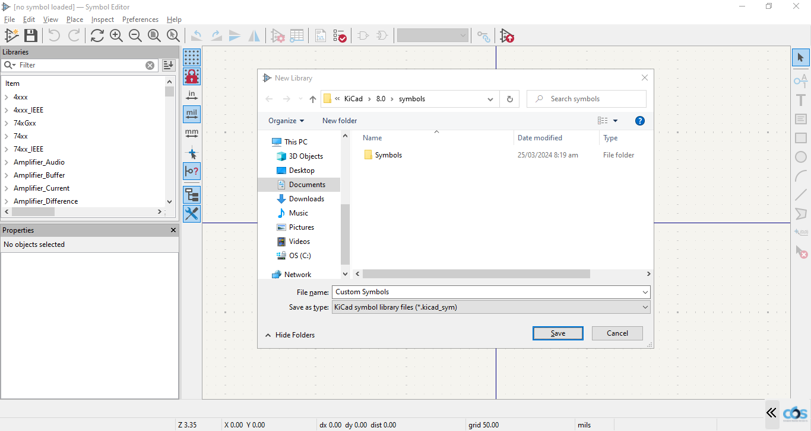

Once you have your new library, press the _"Create new symbol"_ button on the top toolbar or under the _Files_ tab. 

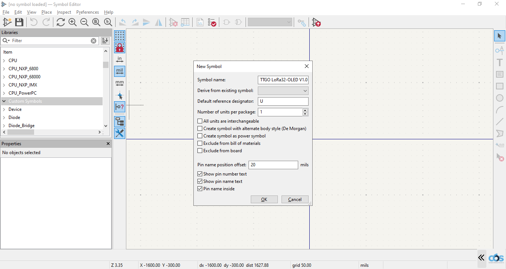

Here you will be given the options to change various details about the symbol. These options are not the most important; you may just input the name and choose a reference symbol while leaving the rest default. 

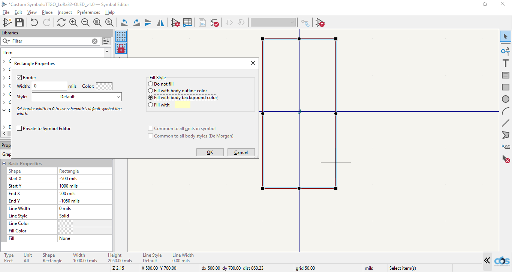

Since the component I'm making is a rectangular micro controller, I used the rectangle tool on the right toolbar to create it. As I said previously, this step is not the most precise so you may use any shape you would like. KiCad has tools to create free lines and arcs so that you may create any shape you really desire. When you have a closed shape, you may double click it to open its properties menu.  Simply select _"Fill with body background color"_. This will fill in the shape and tell KiCad that this is the main body of the symbol. 

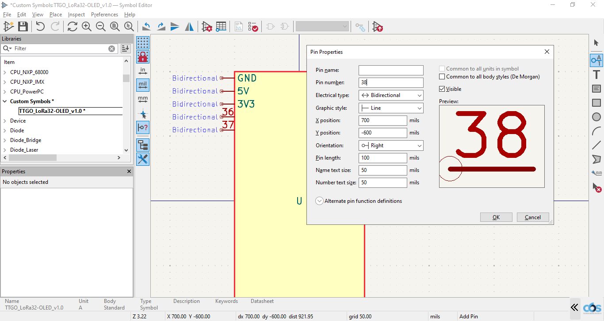

Once your body is filled, you may begin placing the various pins for the component. The _"Add pins"_ tool is found on the right toolbar near the top. When you have the tool selected and you click on the work surface, you will be greeted with this window. With it you can change various things about the pins. This step is the most crucial part of creating KiCad symbols. You need to make sure the type of pins you use are correct and correctly labeled as well. You can usually find the pin configurations of components online; you may use them as guides in this step. 

>[!TIP]
You can edit symbols at anytime during any project so do not be afraid to make mistakes here as you can always fix them later. 

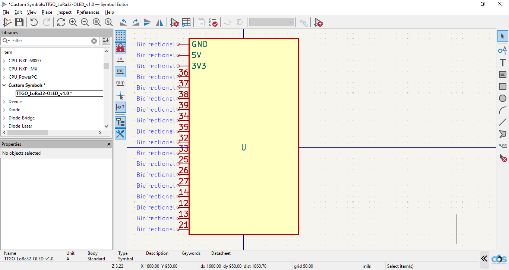

I attached all the pins on one side before moving on to the next. Some pins had names while others had numbers. 

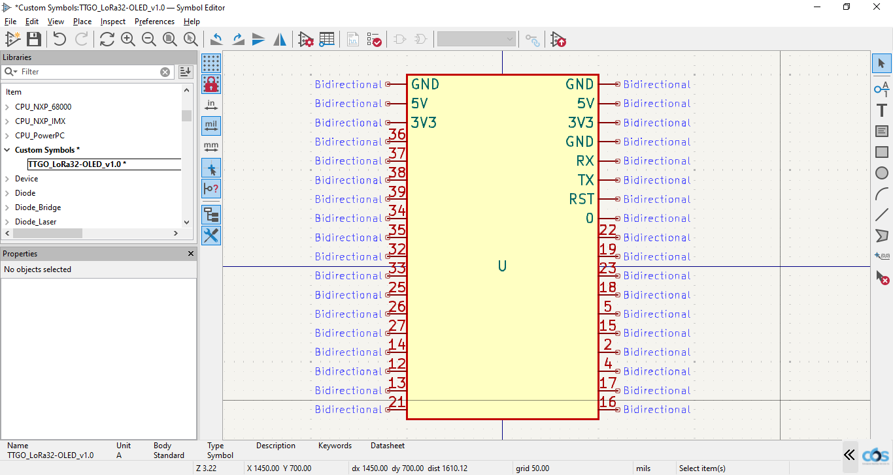

Once you have both sides fully pinned and you added all the parts you needed, you are basically done! This symbol is ready for use in the schematic editor but it has no footprint assigned to it yet. To do this, go to the _"Edit symbol properties"_ button on the top toolbar. From there you can go to the assigned footprint and browse through your footprint libraries. When there, select the footprint you just created to assign it to the symbol.

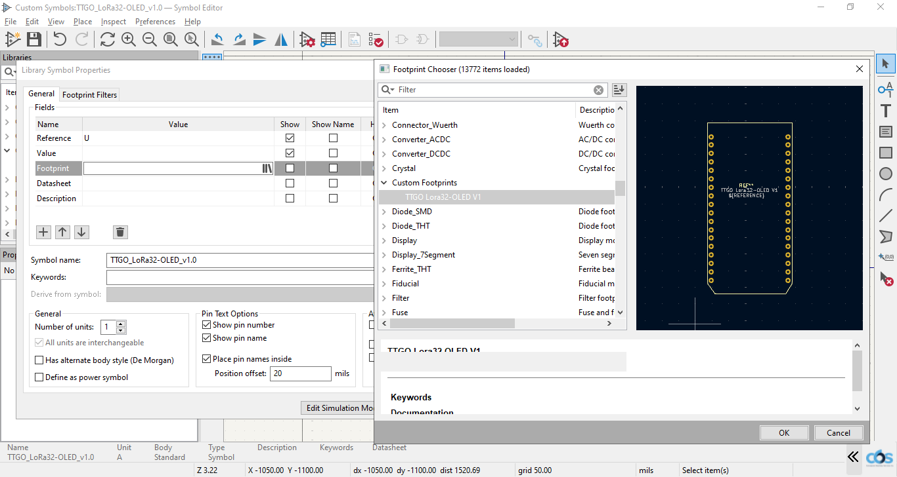

Afterwards you can press "ok" and that will give your symbol a default footprint!

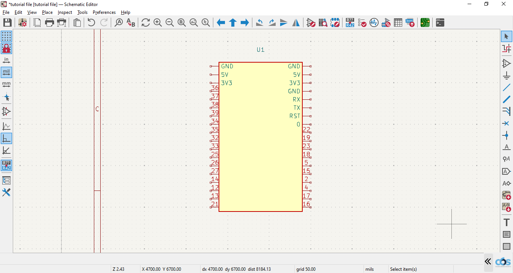

With that your symbol is complete and ready to be used in a schematic!

## Resources and going further

Congratulations! With that yu have completed the tutorial! Now you know the basics of KiCad and can begin your journey creating PCBs and various projects. Have fun!

If your looking for more information on KiCad or you want to learn more than the basics I highly recommend watching tutorials online. There are many amazing guides out there that can show you all the features and capabilities of KiCad as well as PCB design as a whole. 

[Phil's Lab](https://www.youtube.com/@PhilsLab/videos) is a great youtube channel to learn more on these topics for free. He covers all the basics of PCB design and gives helpful tips and information he gained from years of working in the industry. He has multiple KiCad tutorials you can follow along with as well as real world electronics projects. He also has a bunch of courses you can take [here](https://fedevel.com/instructors/philip-salmony#courses) which go into greater detail, however some require payment. 

This guide was based off this old [SparkFun guide.](https://learn.sparkfun.com/tutorials/beginners-guide-to-kicad/all) It was made on an older version of KiCad and needed some updates which is why this tutorial was made. Despite its age, it still contains tons of information on KiCad and gives tons of tips. They also have a wide range of resources on the site that you can use to learn more. 